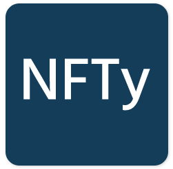
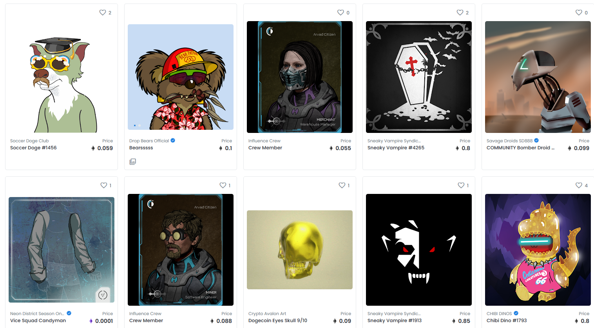

<!-- PROJECT LOGO -->
<br />
<p align="center">
  <a href="https://github.com/HavoxPrime/NFTy">
    
  </a>

  <h3 align="center">NFTy</h3>

  <p align="center">
    Discover, collect, and sell original NFTs
    <br />
    <a href="#about-the-project"><strong>Explore the docs »</strong></a>
    <br />
    <br />
    <a href="https://github.com/HavoxPrime/NFTy">View Demo</a>
    ·
    <a href="https://github.com/HavoxPrime/NFTy/issues">Report Bug</a>
    ·
    <a href="https://github.com/HavoxPrime/NFTy/issues">Request Feature</a>
  </p>
</p>

<!-- TABLE OF CONTENTS -->
<details open="open">
  <summary>Table of Contents</summary>
  <ol>
    <li>
      <a href="#about-the-project">About The Project</a>
            <ul>
        <li><a href="#built-with">Built With</a></li>
      </ul>
    </li>
    <li>
      <a href="#getting-started">Getting Started</a>
      <ul>
        <li><a href="#prerequisites">Prerequisites</a></li>
        <li><a href="#installation">Installation</a></li>
      </ul>
    </li>
    <li><a href="#usage">Usage</a></li>
    <li><a href="#roadmap">Roadmap</a></li>
    <li><a href="#contributing">Contributing</a></li>
    <li><a href="#license">License</a></li>
    <li><a href="#contact">Contact</a></li>
  </ol>
</details>

<!-- ABOUT THE PROJECT -->

## About The Project



NFT stands for non-fungible tokens. NFTs exist on the blockchain, which is a public ledger that records transactions. An NFT is created from digital objects that represent both tangible and intangible items, such as Art, Gifs, Music etc. Essentially, NFT are digital collectors items,. Think baseball cards but digital. They are popular because they are on the blockchain so they can only have one owner at a time and they are nearly impossible to copy.

NFT's are blowing up the digital art and collectable world. Digital art and collectables market has started to explode thanks to the blockchains.
The recent boom in the NFT opened a space for new online marketplaces for artists and collectors to buy and sell NFTs.

NFTy was created to give creators and investors the ability to sell and buy exclusively digital objects that range from funky 3D videos to images of famous tweets and everything in between.

What does NFTy bring to the Marketplace?

- We have created a platform that is easy to access all you need is a login to view and sell NFTs
- All Prices are listed in US dollars opposed to cryptocurrency, making it accessible for first time users
- Our application is responsive so users can buy and sell anywhere!

### Built With

This section lists any major frameworks that was used to build NFTy.

- [Bootstrap](https://getbootstrap.com)
- [JQuery](https://jquery.com)
- [SweetAlert](https://www.npmjs.com/package/sweetalert)
- [Node.js](https://nodejs.org/en/)
- [Heroku](https://heroku.com/)

<!-- GETTING STARTED -->

## Getting Started

This is an example of how you may give instructions on setting up your project locally.
To get a local copy up and running follow these simple example steps.

### Prerequisites

This is an example of how to list things you need to use the software and how to install them.

- npm
  ```sh
  npm install npm@latest -g
  ```

### Installation

1. Get a free API Key at [https://example.com](https://example.com)
2. Clone the repo
   ```sh
   git clone https://github.com/your_username_/Project-Name.git
   ```
3. Install NPM packages
   ```sh
   npm install
   ```
4. Enter your API in `config.js`
   ```JS
   const API_KEY = 'ENTER YOUR API';
   ```

<!-- USAGE EXAMPLES -->

## Usage

Use this space to show useful examples of how a project can be used. Additional screenshots, code examples and demos work well in this space. You may also link to more resources.

_For more examples, please refer to the [Documentation](https://example.com)_

<!-- ROADMAP -->

## Roadmap

See the [open issues](https://github.com/HavoxPrime/NFTy/issues) for a list of proposed features (and known issues).

<!-- CONTRIBUTING -->

## Contributing

Contributions are what make the open source community such an amazing place to learn, inspire, and create. Any contributions you make are **greatly appreciated**.

1. Fork the Project
2. Create your Feature Branch (`git checkout -b feature/NFTy`)
3. Commit your Changes (`git commit -m 'Add some NFTy'`)
4. Push to the Branch (`git push origin feature/NFTy`)
5. Open a Pull Request

<!-- LICENSE -->

## License

Distributed under the MIT License. See `LICENSE` for more information.

<!-- CONTACT -->

## Contact

- Storm Morzos - [@HavoxPrime](https://github.com/HavoxPrime) - storm.morzos@gmail.com
- Kevin Kim - [@KimShiHyun](https://github.com/KimShiHyun) - kevin.shihyun@gmail.com
- Patrick Brown - [@patrickbrown-io](https://github.com/patrickbrown-io) - patbrowndesigns@gmail.com
- Adrian Auchterlonie - [@AdrianAuch](https://github.com/adrianauch) - adrian.auch11@gmail.com

Project Link: [NFTy](https://github.com/HavoxPrime/NFTy)
